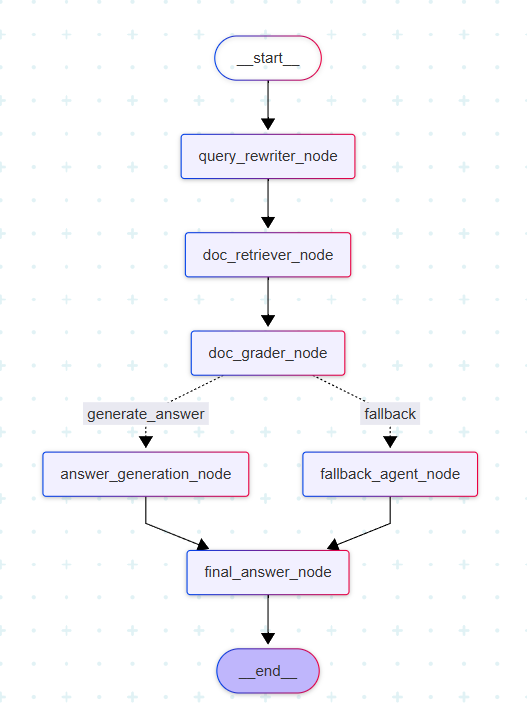

# 🚀 Retrieval-Augmented Generation (RAG) Pipeline

### **AI-Powered Document Analysis and Chat System**
This project implements a complete **end-to-end RAG** system built with **LangGraph**, **FastAPI**, and **Streamlit**.
It allows users to upload multiple documents, automatically extract data, build session-specific FAISS retrievers, and ask natural-language questions over their data all within an interactive chat interface.

---

## 🧠 Overview
**Retrieval-Augmented Generation (RAG)** enhances LLM factual accuracy by combining two key stages:

1. **Retrieval:** Fetch relevant context from stored documents.
2. **Generation:** Use an LLM to generate answers grounded in that context.

This system extends that concept by adding:
- Session-specific document handling
- Dynamic retriever creation
- Multi-agent orchestration using **LangGraph**
- Interactive Streamlit-based chat interface
- MongoDB metadata storage and checkpointing

---

## 🧠 Example Flow

1️⃣ Upload PDF/TXT documents via sidebar.  
2️⃣ The backend extracts content and builds a FAISS index.  
3️⃣ Ask a natural-language question in the chat input.  
4️⃣ LangGraph pipeline processes your query and returns an accurate, grounded answer.

---

## 🏗️ System Architecture
1. Frontend (Streamlit)
    - File uploads (PDF/TXT)
    - Session management
    - Chat-style Q&A with streaming responses
    - Atomatic reruns for live conversation feel

2. Backend (FastAPI)
    - Handles uploads, document extraction, and session creation
    - Builds session-specific FAISS indexes
    - Stores metadata in MongoDB
    - Hosts /upload/ and /query/ endpoints
    - Initializes LangGraph once via lifespan event

3. LangGraph Pipeline
The heart of the RAG process - a directed workflow of specialized nodes:



---

## 🧩 Node responsibilities:
| **Node** | **Purpose** |
|-----------|-------------|
| `query_rewriter_node` | Rephrases user queries for optimal retrieval. |
| `doc_retriever_node` | Uses FAISS retriever to fetch relevant chunks. |
| `doc_grader_node` | Evaluates retrieved documents’ relevance. |
| `answer_generation_node` | Generates the final answer using LLMs. |
| `fallback_agent_node` | Returns a safe fallback response when no relevant documents are found. |
| `final_answer_node` | Ensures the `generated_answer` field is always present for clean API responses. |

---

## ⚙️ Tech Stack
| **Component** |   **Technology** |
|-----------|----------|
|`Frontend`   |   Streamlit|
|`Backend`    |   FastAPI|
|`Orchestration`  | LangGraph|
|`Vector Store`	|   FAISS|
|`Embeddings` |   OpenAI Embeddings (text-embedding-3-small)|
|`Database`   |   MongoDB (Async)|
|`Document Extraction`    |   Custom extract_data_pipeline()
|`Environment`    |   Python 3.11+|

---

## 📂 Directory Structure
```
Directory structure:
└── rawatrahul14-retrieval-augmented-generation/
    ├── README.md
    ├── app.py
    ├── Dockerfile
    ├── graph.py
    ├── main.py
    ├── requirements.txt
    ├── setup.py
    ├── template.py
    ├── config/
    │   ├── details.yaml
    │   ├── models.yaml
    │   └── prompts.yaml
    └── src/
        └── rag_pipeline/
            ├── __init__.py
            ├── agent_state.py
            ├── agents/
            │   ├── __init__.py
            │   ├── doc_retriever.py
            │   ├── fallback.py
            │   ├── generation.py
            │   ├── grader.py
            │   └── query_rewriter.py
            ├── components/
            │   ├── __init__.py
            │   ├── models.py
            │   ├── prompts.py
            │   ├── retriever.py
            │   └── upload.py
            ├── pipeline/
            │   ├── __init__.py
            │   └── data_extract.py
            ├── router/
            │   ├── __init__.py
            │   └── routes.py
            ├── schema/
            │   ├── __init__.py
            │   ├── requests.py
            │   ├── response.py
            │   └── schema.py
            └── utils/
                ├── __init__.py
                ├── common.py
                ├── conversation.py
                └── extract_doc.py
```

---

## 🧩 API Endpoints
### 1️⃣ POST /upload/

Uploads and processes multiple documents.

**Request (multipart/form-data):**
```
files[] = [file1.pdf, file2.txt, ...]
```

**Response:**
```json
{
  "status": "success",
  "session_id": "session_3f2b1e8a",
  "message": "Uploaded 3 files successfully."
}
```

### 2️⃣ POST /query/

Runs the RAG pipeline on uploaded session data.

**Request (JSON):**
```json
{
  "session_id": "session_3f2b1e8a",
  "user_query": "What is RAG?"
}
```

**Response:**
```json
{
  "status": "success",
  "session_id": "session_3f2b1e8a",
  "answer": "RAG stands for Retrieval-Augmented Generation..."
}
```

## 💬 Streamlit Interface
Features:
- Upload multiple files per session
- Session-based chat with history
- Typing-like streaming effect for assistant replies
- Visual separation for user/assistant messages
- Auto-rerun on each new message for smooth conversation flow
- Minimal Logic in the frontend

---

## 🔧 Setup & Installation
### 1. Clone Repository
```bash
git clone https://github.com/RawatRahul14/Retrieval-Augmented-Generation.git
cd Retrieval-Augmented-Generation
```

### 2. Create and Activate Virtual Environment
```bash
python -m venv .venv
source .venv/bin/activate    # Linux / macOS
.venv\Scripts\activate       # Windows
```

### 3. Install Dependencies
```bash
pip install -r requirements.txt
```

### 4. Set Environment Variables
Create a .env file:
```ini
API_URL = ""
OPENAI_API_KEY = ""
MONGODB_URI = ""
DB_NAME = ""
COLLECTION_NAME = ""
COLLECTION_NAME_UPLOAD = ""
```

---

## 🚀 Running the Application

### **Start FastAPI Backend**
```bash
uvicorn main:app --reload
```

### **Start Streamlit Frontend**
```bash
streamlit run app.py
```

---

## 🗄️ MongoDB Metadata Example
Each session stores:
```json
{
  "session_id": "session_abc123",
  "uploaded_files": [
    {
      "file_name": "Report.pdf",
      "type": "pdf",
      "size_kb": 204.3,
      "total_pages": 6,
      "total_tables": 2
    }
  ],
  "uploaded_at": "2025-10-07T08:04:43Z"
}
```

---

## 📊 Graph Flow Summary
- Fully async workflow using LangGraph’s StateGraph
- Two conditional paths from `doc_grader_node`:
    - -> `answer_generation_node` (if relevant docs found)
    - -> `fallback_agent_node` (if not)
- Both paths converge at `final_answer_node` to guarantee a complete response.

---

## 🧩 Key Design Highlights

✅ Session Isolation - Each user’s documents live in their own folder and retriever instance.  
✅ Dynamic Graph Configuration - Graph loaded once at startup for efficiency.  
✅ MongoDB Checkpointing - Enables persistence and replay.  
✅ Streaming Chat UX - Smooth, real-time feeling on frontend.  
✅ Scalable Architecture - Clean boundaries between upload, retrieval, and generation.  